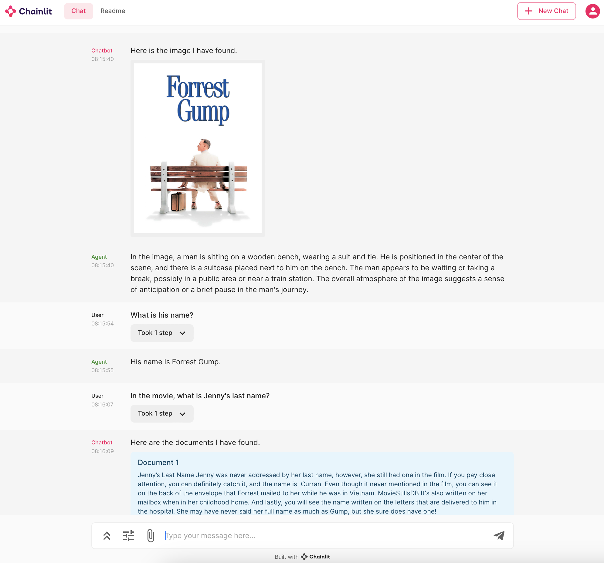
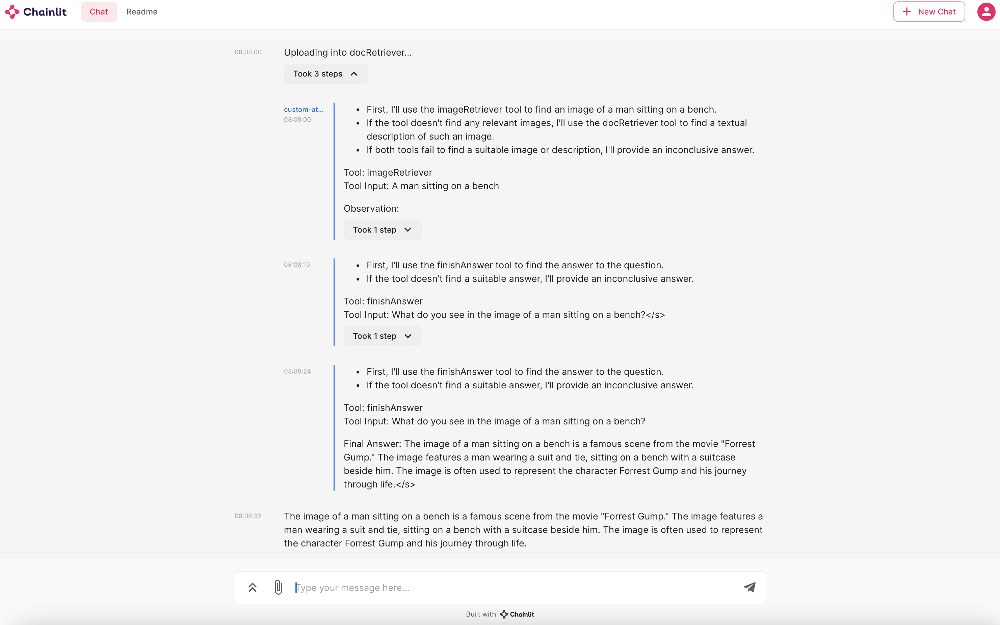

# Chat Demo with Chainlit

We provide the conversation demo with a multi-modal agent, using the [chainlit](https://github.com/Chainlit/chainlit) framework. For more information, please visit their official website [here](https://docs.chainlit.io/get-started/overview).

For a simple chat experience, we load an LLM, such as [meta-llama/Meta-Llama-3-8B-Instruct](https://huggingface.co/meta-llama/Meta-Llama-3-8B-Instruct), by specifying the configuration of like so:

```yaml
task: text-generation
model: "meta-llama/Meta-Llama-3-8B-Instruct"
do_sample: false
max_new_tokens: 300
```

Then, run the following:

```sh
CONFIG=config/regular_chat.yaml chainlit run fastrag/ui/chainlit_no_rag.py
```

For a chat using a RAG pipeline, specify the tools you wish to use in the following format:

```yaml
chat_model:
  generator_kwargs:
      model: microsoft/Phi-3-mini-128k-instruct
      task: "text-generation"
      generation_kwargs:
        max_new_tokens: 300
        do_sample: false
      huggingface_pipeline_kwargs:
        torch_dtype: torch.bfloat16
        max_new_tokens: 300
        do_sample: false
        trust_remote_code: true
  generator_class: haystack.components.generators.hugging_face_local.HuggingFaceLocalGenerator
tools:
  - type: doc
    query_handler:
        type: "haystack_yaml"
        params:
            pipeline_yaml_path: "config/empty_doc_only_retrieval_pipeline.yaml"
    index_handler:
        type: "haystack_yaml"
        params:
            pipeline_yaml_path: "config/empty_index_pipeline.yaml"
    params:
      name: "docRetriever"
      description: 'useful for when you need to retrieve text to answer questions. Use the following format: {{ "input": [your tool input here ] }}.'
```

Then, run the application using the command:

```sh
CONFIG=config/rag_pipeline_chat.yaml chainlit run fastrag/ui/chainlit_pipeline.py
```

## Screenshot




# Multi-Modal Conversational Agent with Chainlit

In this demo, we use the [```xtuner/llava-llama-3-8b-v1_1-transformers```]https://huggingface.co/xtuner/llava-llama-3-8b-v1_1-transformers) model as a conversational agent, that can decide which retriever to use to respond to the user's query.
To perform that, we use dynamic reasoning with [ReAct](https://arxiv.org/abs/2210.03629) prompts, resulting in multiple logical turns.
To explore all the steps to build the agent system, you can check out our [Example Notebook](../examples/multi_modal_react_agent.ipynb).
For more information on how to use ReAct, feel free to visit [Haystack's original tutorial](https://haystack.deepset.ai/tutorials/25_customizing_agent), which our demo is based on.

To run the demo, simply run:

```sh
CONFIG=config/visual_chat_agent.yaml chainlit run fastrag/ui/chainlit_multi_modal_agent.py
```

## Screenshot



# Available Chat Templates

## Default Template

```
The following is a conversation between a human and an AI. Do not generate the user response to your output.
{memory}
Human: {query}
AI:
```

## Llama 2 Template (Llama2)

```
<s>[INST] <<SYS>>
The following is a conversation between a human and an AI. Do not generate the user response to your output.
<</SYS>>

{memory}{query} [/INST]
```

Notice that here we, the user messages will be:

```
<s>[INST] {USER_QUERY} [/INST]
```

And the model messages will be:

```
 {ASSISTATN_RESPONSE} </s>
```

## User-Assistant (UserAssistant)

```
### System:
The following is a conversation between a human and an AI. Do not generate the user response to your output.
{memory}

### User: {query}
### Assistant:
```

## User-Assistant for Llava (UserAssistantLlava)

For the v1.5 llava models, we define a specific template, as shown in [this post regardin Llava models](https://huggingface.co/docs/transformers/model_doc/llava).

```
{memory}

USER: {query}
ASSISTANT:
```
