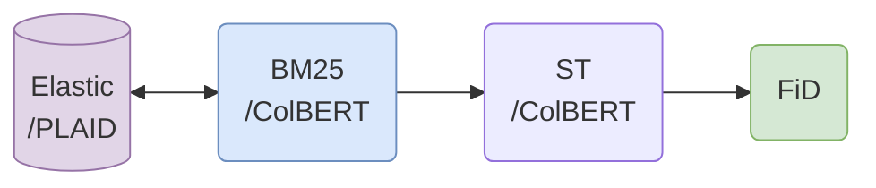
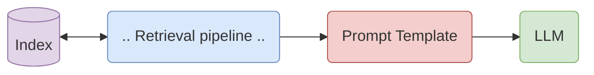
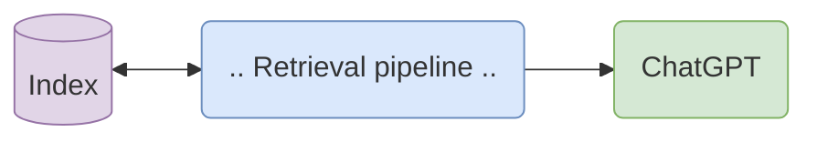
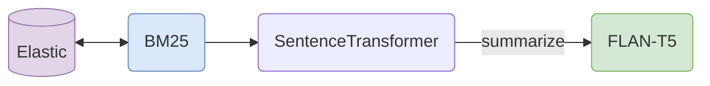
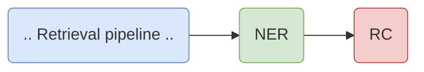

<p align="center">
    
<p>

<h4 align="center">
    <p>Build and explore efficient retrieval-augmented generative models and applications</p>
</h4>

---

<p align="center">
  <a href="#tophat-key-features">Key Features</a> •
  <a href="#books-components">Components</a> •
  <a href="#round_pushpin-installation">Installation</a> •
  <a href="#rocket-getting-started">Getting Started</a> •
  <a href="#dart-example-use-cases">Examples</a>
</p>

fast**RAG** is a research framework designed to facilitate the building of retrieval augmented generative pipelines. Its main goal is to make retrieval augmented generation as efficient as possible through the use of state-of-the-art and efficient retrieval and generative models. The framework includes a variety of sparse and dense retrieval models, as well as different extractive and generative information processing models. fastRAG aims to provide researchers and developers with a comprehensive tool-set for exploring and advancing the field of retrieval augmented generation.

## Updates

- **June 2023**: ColBERT index modification: adding/removing documents; see [IndexUpdater](libs/colbert/colbert/index_updater.py).
- **May 2023**: [RAG with LLM and dynamic prompt synthesis example](examples/rag-prompt-hf.ipynb).
- **April 2023**: Qdrant `DocumentStore` support.

## :tophat: Key Features

- **Retrieval Augmented X**: A framework for developing efficient and fast retrieval augmented generative applications using the latest transformer-based NLP models (but not only).
- **Optimized Models**: Includes optimized models of supported pipelines with greater compute efficiency.
- **Intel Optimizations** (**TBA**): Leverage the latest optimizations developed by Intel for running pipelines with maximum hardware utilization, reduced latency, and increased throughput, using frameworks such as [Intel extensions for PyTorch (IPEX)](https://github.com/intel/intel-extension-for-pytorch) and [Intel extension for Transformers](https://github.com/intel/intel-extension-for-transformers).
- **Customizable**: Built using [Haystack](https://github.com/deepset-ai/haystack) and HuggingFace. All of fastRAG's components are 100% Haystack compatible.


|   |   |
| - | - |
| [Components](fastrag/) | fastRAG components |
| [Models](models.md) | Models overview |
| [Configs](config/) | Example and predefined configurations |
| [Example notebooks](examples/) | Example jupyter notebooks |
| [Demos](demo/README.md) | Example UIs for demos |
| [Benchmarks](benchmarks/README.md) | Misc. benchmarks of fastRAG components |
| [Scripts](scripts/) | Scripts for creating indexes and fine-tuning models |

## :books: Components

For a brief overview of the various models, please refer to the [Models Overview](models.md) section.

Unique components in fastRAG:

- [**PLAID**](https://arxiv.org/abs/2205.09707): An incredibly efficient engine designed for retrieving information through late interaction.
- [**ColBERT**](https://arxiv.org/abs/2112.01488): A Retriever (used in conjunction with PLAID) and re-ranker (employed with dense embeddings) that employs late interaction to determine relevancy scores.
- [**Fusion-in-Decoder (FiD)**](https://arxiv.org/abs/2007.01282): A generative reader tailored for multi-document retrieval augmentation tasks.
- [**Stable Diffusion Generator**](https://arxiv.org/pdf/2112.10752.pdf): A text-to-image generator that can be seamlessly integrated into any pipeline output.
- [Retrieval-Oriented **Knowledge Graph Construction**](https://arxiv.org/abs/2010.01057): A pipeline component responsible for extracting named entities and creating a graph encompassing all entities specified in the retrieved documents, including the relationships between related pairs of entities.

## :round_pushpin: Installation

Preliminary requirements:

- Python version 3.8 or higher
- PyTorch library

To set up the software, perform the following steps in a fresh virtual environment:

```bash
pip install .
```

There are several dependencies to consider, depending on your specific usage:

```bash
# Additional engines/components
pip install .[elastic]             # Support for ElasticSearch store
pip install .[qdrant]              # Support for Qdrant store
pip install libs/colbert           # Indexing engine for ColBERT/PLAID
pip install .[faiss-cpu]           # CPU-based Faiss library
pip install .[faiss-gpu]           # GPU-based Faiss library
pip install .[image-generation]    # Stable diffusion library for image generation
pip install .[knowledge_graph]     # Libraries for working with spacy and KG

# User interface (for demos)
pip install .[ui]

# Benchmarking
pip install .[benchmark]

# Development tools
pip install .[dev]
```


## :rocket: Getting Started

fastRAG leverages Haystack's pipelining abstraction. We recommend constructing a flow by incorporating components provided by fastRAG and Haystack, tailored to the specific task you aim to tackle. There are various approaches to achieving this using fastRAG.

#### Defining Pipelines in Your Code

To define a pipeline in your Python code, you can initialize all the components with the desired configuration directly in your code. This allows you to have full control over the pipeline structure and parameters. For concrete examples and detailed implementation guidance, please refer to the example [notebooks](examples/) provided by our team.

#### Defining Pipelines Using YAML

Another approach to defining pipelines is by writing a YAML file following Haystack's format. This method allows for a more declarative and modular pipeline configuration. You can find detailed information on how to define pipelines using a YAML file in the [Haystack documentation](https://docs.haystack.deepset.ai/docs/pipelines#yaml-file-definitions). The documentation provides guidance on the structure of the YAML file, available components, their parameters, and how to combine them to create a custom pipeline.

We have provided miscellaneous pipeline configurations in the config directory.

#### Serving a Pipeline via REST API

To serve a fastRAG pipeline through a REST API, you can follow these steps:

1. Execute the following command in your terminal:

```bash
python -m fastrag.rest_api.application --config=pipeline.yaml
```

2. If needed, you can explore additional options using the `-h` flag.

3. The REST API service includes support for Swagger. You can access a user-friendly UI to observe and interact with the API endpoints by visiting `http://localhost:8000/docs` in your web browser.

The available endpoints for the REST API service are as follows:

- `status`: This endpoint can be used to perform a sanity check.
- `version`: This endpoint provides the project version, as defined in `__init__.py`.
- `query`: Use this endpoint to run a query through the pipeline and retrieve the results.

By leveraging the REST API service, you can integrate fastRAG pipelines into your applications and easily interact with them using HTTP requests.


#### Generating Pipeline Configurations

<details>
<summary>generate using a script</summary>

The pipeline in fastRAG is constructed using the Haystack pipeline API and is dynamically generated based on the user's selection of components. To generate a Haystack pipeline that can be executed as a standalone REST server service (refer to [REST API](#rest-api)), you can utilize the [Pipeline Generation](scripts/generate_pipeline.py) script.

Below is an example that demonstrates how to use the script to generate a pipeline with a ColBERT retriever, an SBERT reranker, and an FiD reader:

```bash
python generate_pipeline.py --path "retriever,reranker,reader" \
    --store config/store/plaid-wiki.yaml \
    --retriever config/retriever/colbert-v2.yaml \
    --reranker config/reranker/sbert.yaml \
    --reader config/reader/FiD.yaml \
    --file pipeline.yaml
```

In the above command, you specify the desired components using the `--path` option, followed by providing the corresponding configuration YAML files for each component (e.g., `--store`, `--retriever`, `--reranker`, `--reader`). Finally, you can specify the output file for the generated pipeline configuration using the `--file` option (in this example, it is set to `pipeline.yaml`).

</details>

#### Index Creation

For detailed instructions on creating various types of indexes, please refer to the [Indexing Scripts](scripts/indexing/) directory. It contains valuable information and resources to guide you through the process of creating different types of indexes.

#### Customizing Models

To cater to different use cases, we provide a variety of training scripts that allow you to fine-tune models of your choice. For detailed examples, model descriptions, and more information, please refer to the [Models Overview](models.md) page. It will provide you with valuable insights into different models and their applications.

## :dart: Example Use Cases

### Efficient Open Domain Question-Answering

Generate answers to questions answerable by using a corpus of knowledge.

**Retrieval** with fast lexical retrieval with _BM25_ or late-interaction dense retrieval with _PLAID_
</br>
**Ranking** with _Sentence Transformers_ or _ColBERT_
</br>
**Generation** with _Fusion-in-Decoder_



:notebook: [Simple generative open-domain QA with BM25 and ST](examples/simple_oqda_pipeline.ipynb)
</br>
:notebook: [Efficient and fast ODQA with PLAID, ColBERT and FiD](examples/plaid_colbert_pipeline.ipynb)

### Retrival Augmented Generation with a LLM

To enhance generations using a Large Language Model (LLM) with retrieval augmentation, you can follow these steps:

1. Define a retrieval flow: This involves creating a store that holds the relevant information and one or more retrievers/rankers to retrieve the most relevant documents or passages.

2. Define a prompt template: Design a template that includes a suitable context or instruction, along with placeholders for the query and information retrieved by the pipeline. These placeholders will be filled in dynamically during generation.

3. Request token generation from the LLM: Utilize the prompt template and pass it to the LLM, allowing it to generate tokens based on the provided context, query, and retrieved information.

*Most of Huggingface Decoder LLMs are supported*.

See a complete example in our [RAG with LLMs](examples/rag-prompt-hf.ipynb):notebook: notebook.




### ChatGPT Open Domain Reranking and QA

Use ChatGPT API to both rerank the documents for any query, and provide an answer to the query using the chosen documents.

:notebook: [GPT as both Reranker and Reader](examples/gpt_as_both_reranker_and_reader.ipynb)




### Open Domain Summarization

Summarize topics given free-text input and a corpus of knowledge.
**Retrieval** with _BM25_ or other retrievers
</br>
**Ranking** with Sentence Transformers or other rankers
</br>
**Generation** Using `"summarize: "` prompt, all documents concatenated and _FLAN-T5_ generative model

:notebook: [Open Domain Summarization](examples/od_summarization_pipeline.ipynb)



### Retrieval-Oriented Knowledge Graph Construction

Use with any retrieval pipeline to extract Named Entities (NER) and generate relation-maps using Relation Classification Model (RC).

:notebook: [Knowledge Graph Construction](examples/knowledge_graph_construction.ipynb)



### Retrieval-Oriented Answer Image Generation

Use with any retrieval pipeline to generate a dynamic image from the answer to the query, using a diffusion model.

:notebook: [Answer Image Generation](examples/answer_image_generation.ipynb)


## License

The code is licensed under the [Apache 2.0 License](LICENSE).

## Disclaimer

This is not an official Intel product.
