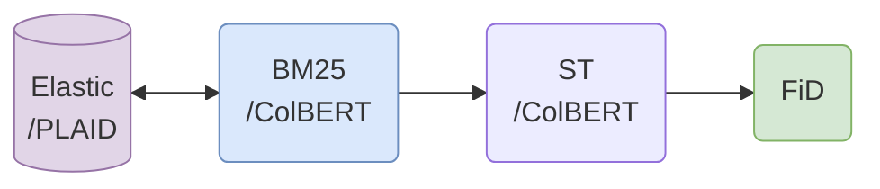
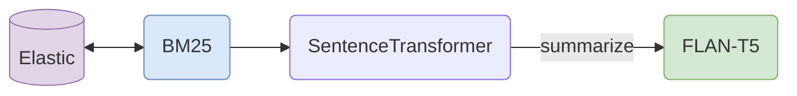
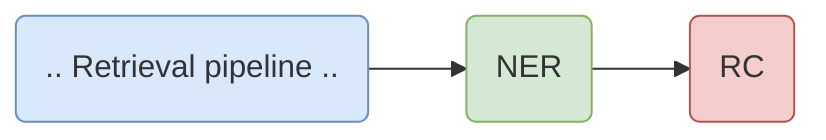

<p align="center">
    
<p>

<h4 align="center">
    <p>Build and explore efficient retrieval-augmented generative models and applications</p>
</h4>

---

<p align="center">
  <a href="#tophat-key-features">Key Features</a> •
  <a href="#round_pushpin-installation">Installation</a> •
  <a href="#books-components">Components</a> •
  <a href="#rocket-example-use-cases">Examples</a> •
  <a href="#running-how-to-use">How To Use</a> •
  <a href="#chart_with_upwards_trend-benchmarks">Benchmarks</a>
</p>

fast**RAG** is a research framework designed to facilitate the building of retrieval augmented generative pipelines. Its main goal is to make retrieval augmented generation as efficient as possible through the use of state-of-the-art and efficient retrieval and generative models. The framework includes a variety of sparse and dense retrieval models, as well as different extractive and generative information processing models. fast**RAG** aims to provide researchers and developers with a comprehensive tool-set for exploring and advancing the field of retrieval augmented generation.

## :tophat: Key Features

- **Retrieval Augmented X**: A framework for developing efficient and fast retrieval augmented generative applications using the latest transformer-based NLP models (but not only).
- **Optimized Models**: Includes optimized models of supported pipelines with greater compute efficiency.
- **Intel Optimizations** (**TBA**): Leverage the latest optimizations developed by Intel for running pipelines with maximum hardware utilization, reduced latency, and increased throughput, using frameworks such as [Intel extensions for PyTorch (IPEX)](https://github.com/intel/intel-extension-for-pytorch) and [Intel extension for Transformers](https://github.com/intel/intel-extension-for-transformers).
- **Customizable**: Built using [Haystack](https://github.com/deepset-ai/haystack) and HuggingFace. All of fastRAG's components are 100% Haystack compatible.

## :round_pushpin: Installation

Preliminary requirements:

- Python 3.8+
- PyTorch

In a new virtual environment, run:

```bash
pip install .
```

There are various dependencies, based on usage:

```bash
# Additional engines/components
pip install .[faiss-cpu]           # CPU-based Faiss
pip install .[faiss-gpu]           # GPU-based Faiss
pip install libs/colbert           # ColBERT/PLAID indexing engine
pip install .[image-generation]    # Stable diffusion library
pip install .[knowledge_graph]     # spacy and KG libraries

# REST API + UI
pip install .[ui]

# Benchmarking
pip install .[benchmark]

# Dev tools
pip install .[dev]
```

## :books: Components

For a short overview of the different models see [Models Overview](models.md).

Unique components in fastRAG:

- [**PLAID**](https://arxiv.org/abs/2205.09707) - An extremely efficient engine for late interaction retrieval.
- [**ColBERT**](https://arxiv.org/abs/2112.01488) - A Retriever (used with PLAID) and re-ranker (used with dense embeddings) utilizing late interaction for relevancy scoring.
- [**Fusion-in-Decoder (FiD)**](https://arxiv.org/abs/2007.01282) - A generative reader for multi-document retrieval augmented tasks.
- [**Stable Diffusion Generator**](https://arxiv.org/pdf/2112.10752.pdf) - A text-to-image generator. Pluggable to any pipeline output.
- [Retrieval-Oriented **Knowledge Graph Construction**](https://arxiv.org/abs/2010.01057) - A pipeline component for extracting named-entities and creating a graph of all the entities specified in the retrieved documents, with the relations between each pair of related entities.

Addition components:

- [Retrieval Augmented Summarization with **T5** family models (such as LongT5, FLAN-T5)](https://arxiv.org/abs/2112.07916) - An encoder-decoder model based on T5 with support for long input, supporting summarization/translation prompts.

## :rocket: Example Use Cases

### Efficient Open Domain Question-Answering

Generate answers to questions answerable by using a corpus of knowledge.

**Retrieval** with fast lexical retrieval with _BM25_ or late-interaction dense retrieval with _PLAID_
</br>
**Ranking** with _Sentence Transformers_ or _ColBERT_
</br>
**Generation** with _Fusion-in-Decoder_



:notebook: [Simple generative open-domain QA with BM25 and ST](examples/simple_oqda_pipeline.ipynb)
</br>
:notebook: [Efficient and fast ODQA with PLAID, ColBERT and FiD](examples/plaid_colbert_pipeline.ipynb)

### Open Domain Summarization

Summarize topics given free-text input and a corpus of knowledge.
**Retrieval** with _BM25_ or other retrievers
</br>
**Ranking** with Sentence Transformers or other rankers
</br>
**Generation** Using `"summarize: "` prompt, all documents concatenated and _FLAN-T5_ generative model



:notebook: [Open Domain Summarization](examples/od_summarization_pipeline.ipynb)

### Retrieval-Oriented Knowledge Graph Construction

Use with any retrieval pipeline to extract Named Entities (NER) and generate relation-maps using Relation Classification Model (RC).



:notebook: [Knowledge Graph Construction](examples/knowledge_graph_construction.ipynb)

### Retrieval-Oriented Answer Image Generation

Use with any retrieval pipeline to generate a dynamic image from the answer to the query, using a diffusion model.


:notebook: [Answer Image Generation](examples/answer_image_generation.ipynb)


## :running: How to Use

fastRAG has a modular architecture that enables the user to build retrieval-augmented pipelines with different components. The components are python classes that take a set of parameters.
We provide multiple examples of sets of parameters used to build common pipelines; the parameters are organized in YAML files in folders such as `store`, `retriever` and `reader`, all under the [Configuration](config) folder.

### Pipeline Configuration Generation

The pipeline is built using Haystack pipeline API and is built dynamically according to the components the user is
interested in. Use the [Pipeline Generation](scripts/generate_pipeline.py) script to generate a Haystack pipeline which can be run by the stand-alone REST server as a service, see [REST API](#rest-api).

Here is an example of using the script to generate a pipeline with a ColBERT retriever, an SBERT reranker and an FiD reader:

```bash
python generate_pipeline.py --path "retriever,reranker,reader"  \
       --store config/store/plaid-wiki.yaml                     \
       --retriever config/retriever/colbert-v2.yaml             \
       --reranker config/reranker/sbert.yaml                    \
       --reader config/reader/FiD.yaml                          \
       --file pipeline.yaml
```

> :warning: PLAID Requirements :warning:
>
> If GPU is needed it should be of type RTX 3090 or newer and PyTorch should be installed with CUDA support using:
>
>```bash
>pip install torch torchvision torchaudio --extra-index-url https://download.pytorch.org/whl/cu116
>```

### Running Pipelines

Pipelines can be run inline (code, service, notebook) once initialized properly. For a concrete example see this [notebook](examples/simple_oqda_pipeline.ipynb).

#### Standalone UI Demos

See [Demo](demo/) for a script creating stand alone demos for several workflows; the script creates a REST service and a UI service, ready to be used. Continue reading for more details on these services.

#### Serve a pipeline via a REST service

One can start a REST server with a defined pipeline YAML and send queries for processing or benchmarking. A pipeline is
generated according to [Pipeline Generation](#pipeline-configuration-generation) step; see [Usage](#usage).

Run the following:

```bash
python -m fastrag.rest_api.application --config=pipeline.yaml
```

This will start a `uvicorn` server and build a pipeline as defined in the YAML file.

There is support for Swagger. One can observe and interact with endpoints in a simple UI by vising `http://localhost:8000/docs` (might need to forward ports locally, if working on a cluster).

These are the following endpoint:

- `status`: sanity.
- `version`: project version, as defined in `__init__`.
- `query`: a general query, used for debugging.

#### Run a demo UI

Define the endpoint address according to where the web server is; e.g. `localhost` if you start the web server on the
same machine; and run the following:

```bash
API_ENDPOINT=http://localhost:8000 \
             python -m streamlit run fastrag/ui/webapp.py
```

### Creating Indexes

See [Indexing Scripts](scripts/indexing/) for information about how to create different types of indexes.

### Pre-training/Fine-tuning Models

We offer an array of training scripts, to finetune models of your choice for various usecases. See [Models Overview](models.md) for examples, model descriptions, and more.

## :chart_with_upwards_trend: Benchmarks

Benchmarks scripts and results can be found here: [Benchmarks](benchmarks/).

## License

The code is licensed under the [Apache 2.0 License](LICENSE).

## Disclaimer

This is not an official Intel product.
