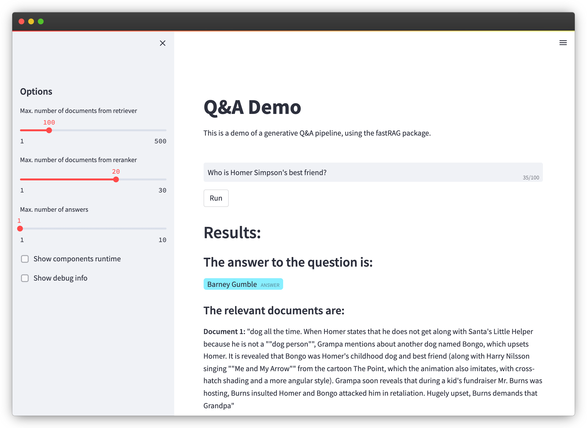

# Running Demos

To execute a demo, use its configuration name. For instance:

```sh
python run_demo.py -t QA1
```

The server and UI will be spawned as subprocesses that run in the background. You can use the PIDs (Process IDs) to terminate them when needed.

To obtain a list of available configurations, utilize the `--help` flag.

## Available Demos

| Name    | Description                                                                          | Config Name |
|:--------|:-------------------------------------------------------------------------------------|:-----------:|
| Q&A     | Abstractive Q&A demo utilizing BM25, SBERT reranker, and FiD model.                   | `QA1`       |
| Q&A     | Abstractive Q&A demo using ColBERT v2 (with PLAID index) retriever and FiD reader.   | `QA2`       |
| Summarization | Summarization demo employing BM25, SBERT reranker, and long-T5 reader.               | `SUM`       |
| Image   | Abstractive Q&A demo with an image generation model for the answer.                   | `QADIFF`    |
| LLM     | Retrieval augmented generation with generative LLM model.                             | `LLM`       |

Please note that the ColBERT demo with a Wikipedia index may take around 15 minutes to load. Also, make sure to review the [README](../models.md#plaid-requirements) for information regarding GPU usage requirements.

### Additional Options

If you already have a fastRAG pipeline service running locally and wish to utilize it with one of the provided UI interfaces, you can add the `--only-ui` flag to the demo script:

```sh
python run_demo.py -t LLM --only-ui
```

In case your pipeline service is running on a non-local machine or a different port other than 8000, you can use the `--endpoint` argument to specify the URL:

```sh
python run_demo.py -t LLM --endpoint http://hostname:80
```

To manually run a UI with the `API_ENDPOINT` directed to a fastRAG service, you can execute the following command:

```bash
API_ENDPOINT=http://localhost:8000 \
             python -m streamlit run fastrag/ui/webapp.py
```

Make sure to replace `http://localhost:8000` with the appropriate URL of your fastRAG service.

## Screenshot


