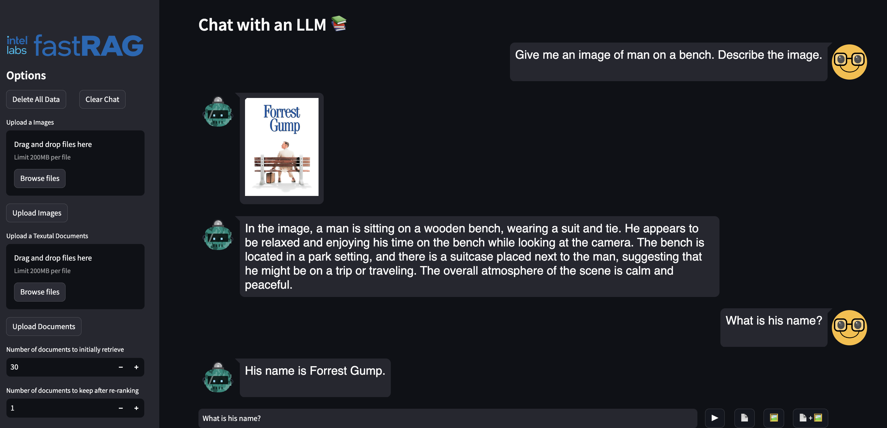

# Running Demos

To execute a demo, use its configuration name. For instance:

```sh
python run_demo.py -t QA1
```

The server and UI will be spawned as subprocesses that run in the background. You can use the PIDs (Process IDs) to terminate them when needed.

To obtain a list of available configurations, utilize the `--help` flag.

## Available Demos

| Name    | Description                                                                          | Config Name |
|:--------|:-------------------------------------------------------------------------------------|:-----------:|
| Q&A     | Abstractive Q&A demo utilizing BM25, SBERT reranker, and FiD model.                   | `QA1`       |
| Q&A     | Abstractive Q&A demo using ColBERT v2 (with PLAID index) retriever and FiD reader.   | `QA2`       |
| Summarization | Summarization demo employing BM25, SBERT reranker, and long-T5 reader.               | `SUM`       |
| LLM     | Retrieval augmented generation with generative LLM model.                             | `LLM`       |

Please note that the ColBERT demo with a Wikipedia index may take around 15 minutes to load. Also, make sure to review the [README](../models.md#plaid-requirements) for information regarding GPU usage requirements.

### Additional Options

If you already have a fastRAG pipeline service running locally and wish to utilize it with one of the provided UI interfaces, you can add the `--only-ui` flag to the demo script:

```sh
python run_demo.py -t LLM --only-ui
```

In case your pipeline service is running on a non-local machine or a different port other than 8000, you can use the `--endpoint` argument to specify the URL:

```sh
python run_demo.py -t LLM --endpoint http://hostname:80
```

To manually run a UI with the `API_ENDPOINT` directed to a fastRAG service, you can execute the following command:

```bash
API_ENDPOINT=http://localhost:8000 \
             python -m streamlit run fastrag/ui/webapp.py
```

Make sure to replace `http://localhost:8000` with the appropriate URL of your fastRAG service.

## Screenshot


# Chat with Documents and Images

We present how to set up a demo with both Textual and Visual Question-Answering Pipelines, for a conversational chat system.


## Chat Templates

For our chat model, we can specify how the chat template will behave.
Each chat templates must include:
* The memory of the chat.
* The current query from the user.

In order to use them, specify the name to use in the configuration for each template in ().
We present the available chat templates [the section below](#available-chat-templates).

## Deploy the API

We deploy the rest API service as follows:

```bash
python -m fastrag.rest_api.application --app_type conversation --config config/doc_chat.yaml --port 8000
```

In the command above, we provide a chat YAML configuration file [doc_chat](config/doc_chat.yaml), with the following format:

```yaml
chat_model:
  model_kwargs:
    device_map: {"": 3}
    model_max_length: 4096
    task_name: text-generation
  model_name_or_path: meta-llama/Llama-2-7b-chat-hf
  use_gpu: true
doc_pipeline_file: "config/empty_retrieval_pipeline.yaml"
```

In this example, we deploy a chat_model, and also provide a doc_pipeline_file yaml file, that specifies our document retrieval pipeline.

We can also add a separate model for chat summarization in our chat configuration file, like so:

```yaml
chat_model:
  ...
summary_model:
  model_kwargs:
    device_map: {"": 3}
    model_max_length: 4096
    task_name: text-generation
  model_name_or_path: togethercomputer/Llama-2-7B-32K-Instruct
  use_gpu: true
...
```

In case you want to use a different prompt template for the chat model, you can choose either Llama2 and UserAssistant formats as well. You can specify it by adding to your chat configuration file:

```yaml
chat_model:
  ...
doc_pipeline_file: ...
chat_template: "Llama2"
```

To inspect the templates, we refer to the [chat_template_initalizers.py](fastrag/rest_api/chat_template_initalizers.py) file.


## Deploy Visual Chat API

To utilize the visual chat sytem, we need to specify two models: a chat model, and a seperate summary model, as follows:

```yaml
chat_model:
  model_kwargs:
    task_name: text-generation
    device_map: {"":0}
    load_in_4bit: true
    torch_dtype: torch.float16
  model_name_or_path: llava-hf/llava-1.5-7b-hf
  use_gpu: true
summary_model:
  model_kwargs:
    model_max_length: 4096
    task_name: text-generation
    device_map: {"":1}
  model_name_or_path: winglian/Llama-2-3b-hf
  use_gpu: true
summary_params:
  summary_frequency: 10
chat_template: "UserAssistantLlava"
doc_pipeline_file: "config/empty_retrieval_pipeline.yaml"
image_pipeline_file: "config/image_retrieval.yaml"
```

Notice that we are using the "UserAssistantLlava" chat template, since it is the chat_template that is supported for the specified Llava model.

In this case, we also added an [image_pipeline_file](config/image_retrieval.yaml), and changed the chat model to a visual chat model.

Using the new configuration file, we can deploy it as follows:

```bash
python -m fastrag.rest_api.application --app_type conversation --config config/visual_chat.yaml --port 8000
```

## Deploy UI

Then, we can deploy the document user-interface using:

```bash
API_CONFIG_PATH=config/doc_chat.yaml API_ENDPOINT=http://localhost:8000 python -m streamlit run fastrag/ui/chat_ui.py --server.port 8501
```

Alternatively, you can deploy the visual chat interface using:

```bash
API_CONFIG_PATH=config/visual_chat.yaml API_ENDPOINT=http://localhost:8000 python -m streamlit run fastrag/ui/chat_ui.py --server.port 8501
```

### Screenshot




## Chat Demo with Chainlit

We also provide the conversation demo with a multi-modal agent, using the [chainlit](https://github.com/Chainlit/chainlit) framework. For more information, please visit their official website [here](https://docs.chainlit.io/get-started/overview).

```sh
CONFIG=config/visual_chat.yaml chainlit run --port 8000 fastrag/ui/chainlit_multi_modal.py
```

### Screenshot


# Multi-Modal Conversational Agent with Chainlit

In this demo, we use the [```llava-hf/llava-1.5-7b-hf```](https://huggingface.co/llava-hf/llava-1.5-7b-hf) model as a conversational agent, that can decide which retriever to use to respond to the user's query.
To perform that, we use dynamic reasoning with [ReAct](https://arxiv.org/abs/2210.03629) prompts, resulting in multiple logical turns.
To explore all the steps to build the agent system, you can check out our [Example Notebook](../examples/multi_modal_react_agent.ipynb).
For more information on how to use ReAct, feel free to visit [Haystack's original tutorial](https://haystack.deepset.ai/tutorials/25_customizing_agent), which our demo is based on.

To run the demo, simply run:

```sh
CONFIG=config/visual_chat_agent.yaml chainlit run fastrag/ui/chainlit_multi_modal_agent.py
```

We also offer utilizing the [llama-cpp](https://github.com/ggerganov/llama.cpp) implementation of the Llava model as well. We provide an example yaml file for running it, and you can use it by running:

```sh
CONFIG=config/visual_chat_agent_llamacpp.yaml chainlit run fastrag/ui/chainlit_multi_modal_agent.py
```

### Screenshot


# Available Chat Templates

### Default Template

```
The following is a conversation between a human and an AI. Do not generate the user response to your output.
{memory}
Human: {query}
AI:
```

### Llama 2 Template (Llama2)

```
<s>[INST] <<SYS>>
The following is a conversation between a human and an AI. Do not generate the user response to your output.
<</SYS>>

{memory}{query} [/INST]
```

Notice that here we, the user messages will be:

```
<s>[INST] {USER_QUERY} [/INST]
```

And the model messages will be:

```
 {ASSISTATN_RESPONSE} </s>
```

### User-Assistant (UserAssistant)

```
### System:
The following is a conversation between a human and an AI. Do not generate the user response to your output.
{memory}

### User: {query}
### Assistant:
```

### User-Assistant for Llava (UserAssistantLlava)

For the v1.5 llava models, we define a specific template, as shown in [this post regardin Llava models](https://huggingface.co/docs/transformers/model_doc/llava).

```
{memory}

USER: {query}
ASSISTANT:
```
