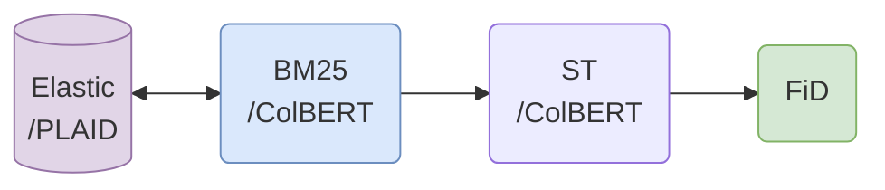
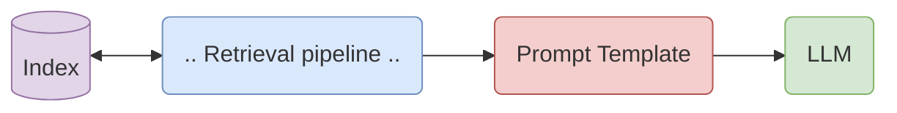
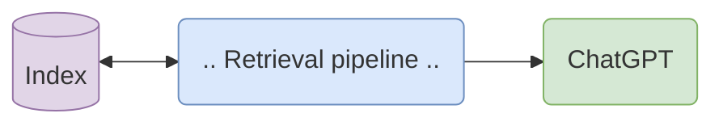
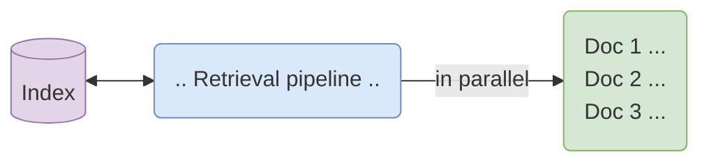
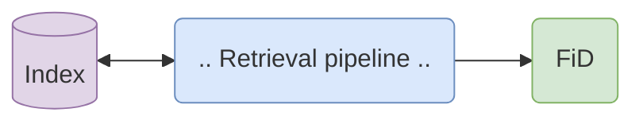
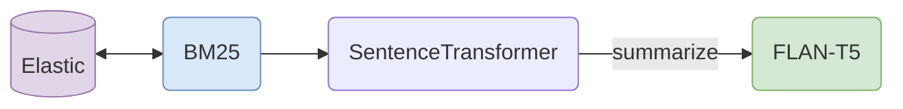
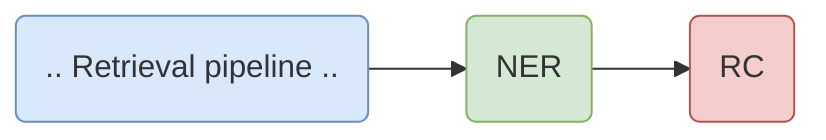

# :dart: Example Use Cases

| Example notebook                         | Link |
|------------------------------------------|-------------|
| RAG pipeline for question-answering | [:notebook_with_decorative_cover:](examples/simple_oqda_pipeline.ipynb) |
| RAG pipeline with LLMs loaded from Hugging Face | [:notebook_with_decorative_cover:](examples/rag-prompt-hf.ipynb) |
| RAG pipeline with FiD generator | [:notebook_with_decorative_cover:](examples/fid_promping.ipynb) |
| RAG pipeline with REPLUG-based generator | [:notebook_with_decorative_cover:](examples/replug_parallel_reader.ipynb) |
| RAG pipeline with LLMs running on Gaudi2 |[:notebook_with_decorative_cover:](examples/inference_with_gaudi.ipynb) |
| RAG pipeline with quantized LLMs running on ONNX-running backend | [:notebook_with_decorative_cover:](examples/rag_with_quantized_llm.ipynb) |
| RAG pipeline with LLMs running on Llama-CPP backend | [:notebook_with_decorative_cover:](examples/client_inference_with_Llama_cpp.ipynb) |
| Optimized and quantized Embeddings models for retrieval and ranking | [:notebook_with_decorative_cover:](examples/optimized-embeddings.ipynb) |
| RAG pipeline with PLAID index and ColBERT Ranker | [:notebook_with_decorative_cover:](examples/plaid_colbert_pipeline.ipynb) |
| RAG pipeline with Qdrant index | [:notebook_with_decorative_cover:](examples/qdrant_document_store.ipynb) |
| Use ChatGPT API to re-rank documents and generate an answer | [:notebook_with_decorative_cover:](examples/gpt_as_both_reranker_and_reader.ipynb) |
| RAG pipeline for summarization of multiple documents | [:notebook_with_decorative_cover:](examples/od_summarization_pipeline.ipynb) |
| RAG pipeline with generator and a knowledge-graph | [:notebook_with_decorative_cover:](examples/knowledge_graph_construction.ipynb) |

## Efficient Open Domain Question-Answering with Quantized Components

Generate answers to questions answerable by using a corpus of knowledge.

**Retrieval** with fast lexical retrieval with _BM25_ or late-interaction dense retrieval with _PLAID_
 
**Ranking** with _Sentence Transformers_ or _ColBERT_. We also offer utilizing highly optimized quantized re-rankers for fast inference. See how to get your own [here](optimization/reranker_quantization/quantization.md).
 
**Generation** with _Fusion-in-Decoder_

:notebook: [Simple generative open-domain QA with BM25 and ST](examples/simple_oqda_pipeline.ipynb)
 
:notebook: [Efficient and fast ODQA with PLAID, ColBERT and FiD](examples/plaid_colbert_pipeline.ipynb) 
:notebook: [Quantized Retrievers and Rankers using bi-encoders](examples/optimized-embeddings.ipynb)

## Retrieval Augmented Generation with a LLM

To enhance generations using a Large Language Model (LLM) with retrieval augmentation, you can follow these steps:

1. Define a retrieval flow: This involves creating a store that holds the relevant information and one or more retrievers/rankers to retrieve the most relevant documents or passages.

2. Define a prompt template: Design a template that includes a suitable context or instruction, along with placeholders for the query and information retrieved by the pipeline. These placeholders will be filled in dynamically during generation.

3. Request token generation from the LLM: Utilize the prompt template and pass it to the LLM, allowing it to generate tokens based on the provided context, query, and retrieved information.

*Most of Huggingface Decoder LLMs are supported*.

See a complete example in our [RAG with LLMs](examples/rag-prompt-hf.ipynb):notebook: notebook.

## ChatGPT Open Domain Reranking and QA

Use ChatGPT API to both rerank the documents for any query, and provide an answer to the query using the chosen documents.

:notebook: [GPT as both Reranker and Reader](examples/gpt_as_both_reranker_and_reader.ipynb)

### Using REPLUG for Parallel Document Reading with LLMs

Using the algorithm introduced in [REPLUG: Retrieval-Augmented Black-Box Language Models
](https://arxiv.org/abs/2301.12652) to read multiple documents in parallel to generate an answer for any question.

:notebook: [Using REPLUG for Parallel Document Reading with LLMs](examples/replug_parallel_reader.ipynb)

## Fusion-in-Decoder

We enable the utilization of the FiD model, to read multiple documents in parallel, thus generating an answer with the fusion of the knowledge in all retrieved documents.

:notebook: [Fusion-in-Decoder (FiD)](examples/fid_promping.ipynb)

## Open Domain Summarization

Summarize topics given free-text input and a corpus of knowledge.
**Retrieval** with _BM25_ or other retrievers
 
**Ranking** with Sentence Transformers or other rankers
 
**Generation** Using `"summarize: "` prompt, all documents concatenated and _FLAN-T5_ generative model

:notebook: [Open Domain Summarization](examples/od_summarization_pipeline.ipynb)

## Retrieval-Oriented Knowledge Graph Construction

Use with any retrieval pipeline to extract Named Entities (NER) and generate relation-maps using Relation Classification Model (RC).

:notebook: [Knowledge Graph Construction](examples/knowledge_graph_construction.ipynb)

